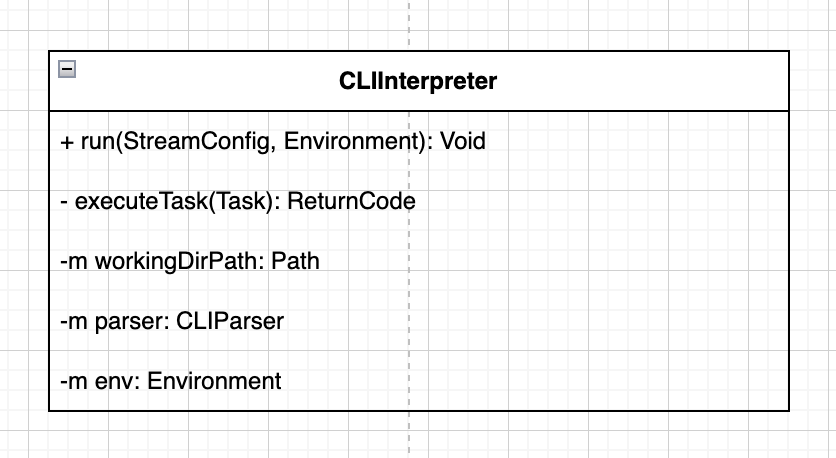
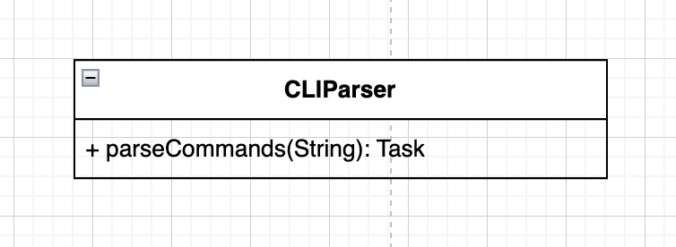
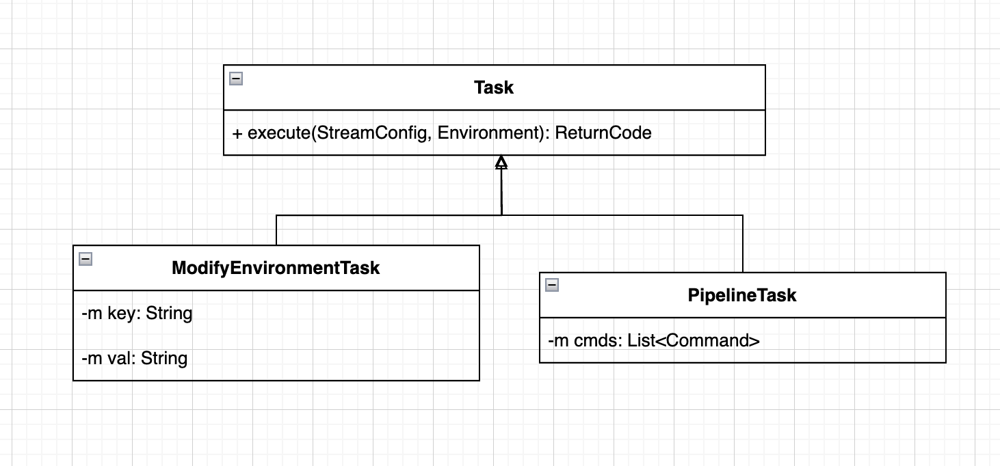
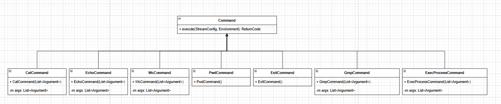
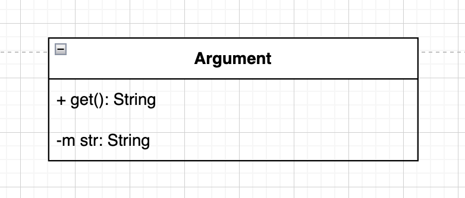
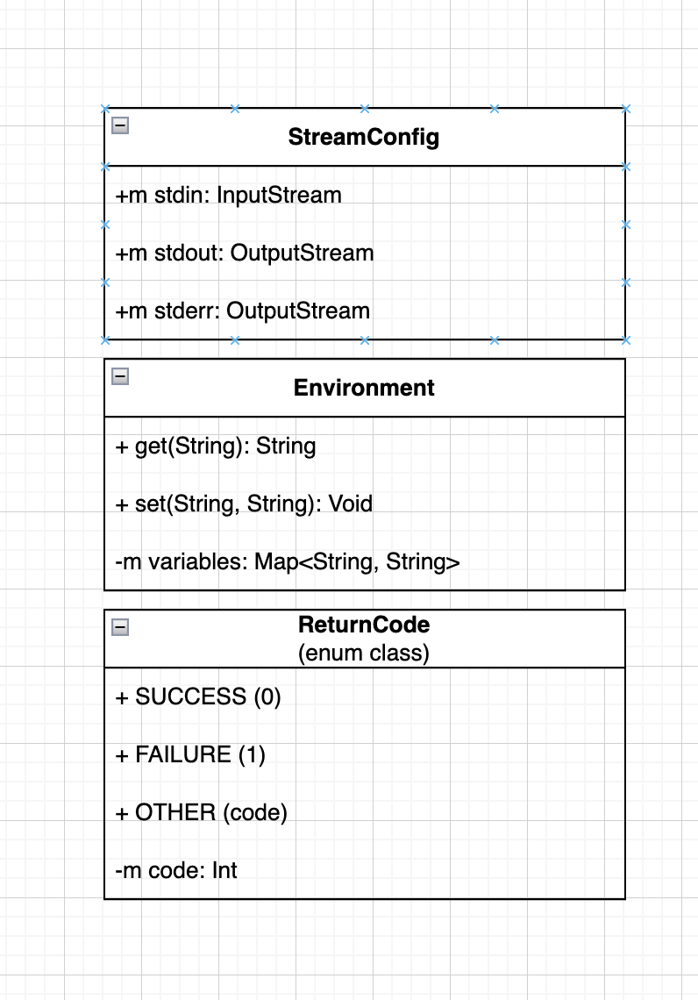

# CLI

> Программа, эмулирующая работу интепретатора коммандной строки. Необходимо поддержать несколько встроенных комманд, а также запуск отдельного процесса, в котором будут исполнять все нераспознанные комманды.

## Команда
- Артюхов Владислав
- Артюхов Дмитрий
- Юкачев Дмитрий

## Обозначения

Ниже будут использоваться диаграммы классов и наследования. Тут я приведу некоторые пояснения к обозначниям методов и полей этих классов:
- `+`: публичность поля/метода
- `-`: приватность поля/метода
- `m`: от слова member - поле класса, при отсутствии этого модификатора подразумевается определение метода

## Описание архитектуры

В нашей реализации будет несколько основных подсистем:

### 1. `CLIInterpreter`

Класс интерпретатора, получающий в аргументах исходный environment (переданный самой программе, реализующей CLI) и потоки, которые представляют собой stdin, stdout, stderr для интерпретатора. Метод `run` этого класса реализует бесконечный цикл, в котором парсится входной поток, запускаются комманды и происходит вывод в выходной поток и поток ошибок. Завершение цикла обработки происходит по обнаружению комманды `exit`, или терменировании процесса, в котором запущен CLI.

<p align="center">
    
</p>

Более детально цикл работы интерпретатора:
- Получить строку из потока ввода
- Отправить ее в `CLIParser` (см. ниже)
- Получить из парсера таску (см. ниже)
    - `ModifyEnvironmentTask`: обновляем окружение новый key-value парой.
    - `PipelineTask`: исполнить пайплайн комманд.

### 2. `CLIParser`

Класс, который парсит из строки таски для исполнения интерпретатору:

- `ModifyEnvironmentTask`: таска, соответствующая обновлению переменной в environment интерпретатора.
  
    Такая таска может быть только одна в входной строке, то есть такой ввод является корректным:
    ```txt
    > VAR1=value
    ```
        
    
    В то время как такие нет:
    ```txt
    > VAR1=value | VAR2=value | ...
    > echo "Hi" | VAR1=value | cat file.txt | ...
    ```

    То есть изменение окружения **не может быть** запайплено и **не может быть** частью пайплайна обычных комманд.

- `PipelineTask`: таска, соответствующая исполненияю пайпалайна из одной или нескольких комманд (с учетом, что изменения окружения в пайплайне быть не может). Код возрата берется из последней комманды (по аналогии как сделано в bash по дефолту - без применения команды `set -o pipefail`).

<p align="center">
    
    <br/>
    
</p>

### 3. `Command`

Абракция, реализуюшая интерфейс комманды. Она имеет метод `execute(StreamConfig, Environment): ReturnCode`, принимающая конфиг из потоков (in, out, err) и окружения и возвращающая свой код возврата.

Все кастомные комманды (`cat`, `echo`, `wc`, `pwd`, `exit`) и те, что требуют запуска отдельного процесса, являются наследниками интерфейса `Command` и получают нужный им для работы набор аргументов в контрукторе.

<p align="center">
    
</p>

**Note**: в описанной нами архитектуре комманды в паплайне могут исполняться как последовально, так и через запуск отдельных единиц параллельного исполнения с блокирующим чтением внутри тасок из in потоков (например, через котлин корутины и каналы). Однако мы скорее всего имплементируем более простой вариант через последовальное исполнения комманд.

### 4. `Argument`

Абракция отвечающая за представление аргументов комманд. Глобально тут есть два имплементатора этого класса:
- `DoubleQuotesArgument`: хранит строковое представление аргумента as-is, то есть не подставляет переменные окружения и экранирует спец. символы по типу `\n` и `\t`.
- `SmartArgument`: этот тип аргументов применяет подстановку переменных из окружения и не экранирует спец. символы (его наследники это `SingleQuotesArgument` и `RegularArgument`).

<p align="center">
    
</p>


### 5. Вспомогательные объекты

Ниже приведены объекты, реализующие более простые компоненты абстрации:
- `StreamConfig`: аггрегирующая структура, содержащая в себе in, out и err потоки для передачи в различные сущности программы.
- `Environment`: абстракция среды окружения, хранящей маппинги ключ-значние.
- `ReturnCode`: enum-класс, означающий коды возврата комманд.

<p align="center">
    
</p>


## Ссылки:
- Исходники UML диграмм: [ссылка](https://drive.google.com/file/d/1RxAk_gkMuU3yro490gdI4PoGJ4LMWQYF/view?usp=sharing).
- Лицензия: [MIT License](./LICENSE)