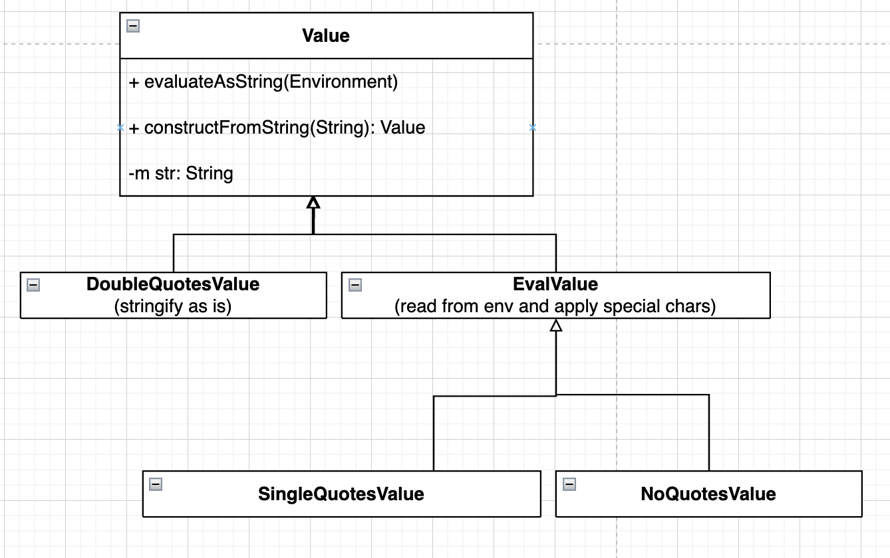

# Описание архитектуры

## Обозначения

Ниже будут использоваться диаграммы классов и наследования. Тут я приведу некоторые пояснения к обозначниям методов и полей этих классов:
- `+`: публичность поля/метода
- `-`: приватность поля/метода
- `m`: от слова member - поле класса, при отсутствии этого модификатора подразумевается определение метода

## Компоненты приложения

В нашей реализации будет несколько основных подсистем:

### 1. `CLIInterpreter`

Класс интерпретатора, получающий в аргументах исходный environment (переданный самой программе, реализующей CLI) и потоки, которые представляют собой stdin, stdout, stderr для интерпретатора. Метод `run` этого класса реализует бесконечный цикл, в котором парсится входной поток, запускаются комманды и происходит вывод в выходной поток и поток ошибок. Завершение цикла обработки происходит по обнаружению комманды `exit`, или терменировании процесса, в котором запущен CLI.

<p align="center">
    
</p>

Более детально цикл работы интерпретатора:
- Получить строку из потока ввода
- Отправить ее в `CLIParser` (см. ниже)
- Получить из парсера таску (см. ниже)
    - `ModifyEnvironmentTask`: обновляем окружение новый key-value парой.
    - `PipelineTask`: исполнить пайплайн комманд.

### 2. `CLIParser`

Класс, который парсит из строки таски для исполнения интерпретатору:

- `ModifyEnvironmentTask`: таска, соответствующая обновлению переменной в environment интерпретатора.
  
    Такая таска может быть только одна в входной строке, то есть такой ввод является корректным:
    ```txt
    > VAR1=value
    ```
        
    
    В то время как такие нет:
    ```txt
    > VAR1=value | VAR2=value | ...
    > echo "Hi" | VAR1=value | cat file.txt | ...
    ```

    То есть изменение окружения **не может быть** запайплено и **не может быть** частью пайплайна обычных комманд. В bash установка окружения через пайпы возможна и разумна, если мы, например, хотим для какой-то одной команды из пайпа установить переменную окружения, а для остальных не хотим (к примеру, `VAR1=value1 && cmd1 | VAR2=value2 && cmd2`). Но у нас в задаче нет синтаксиса `&&`, поэтому мы просто запрещаем такое писать.

- `PipelineTask`: таска, соответствующая исполнению пайпалайна из одной или нескольких комманд (с учетом, что изменения окружения в пайплайне быть не может). 
  - Код возрата берется из последней комманды (по аналогии как сделано в bash по дефолту - без применения команды `set -o pipefail`).
  - Для того, чтобы связать потоки ввода/вывода между соседними командами пайплайна, используется метод команды `Command::execute(StreamConfig, Environment)`, где первым параметром передается конфиг. Пусть мы запускаем комманду по номером `i`, тогда:
    - в поле stdin записывается stdout команды `i - 1`
    - в поле stdout записывается stdin команды `i + 1`
    - stderr мы всем задаем тот, что был передан в конфиге интерпретатора (то есть все комманды пишут свои ошибки в один поток ошибок, что соотносится с тем, как работает bash пайпы)
  
  Подробнее про комманды, см. ниже.

<p align="center">
    
    <br/>
    
</p>

### 3. `Command`

Абракция, реализуюшая интерфейс комманды. Она имеет метод `execute(StreamConfig, Environment): ReturnCode`, принимающая конфиг из потоков (in, out, err) и окружения и возвращающая свой код возврата.

Все кастомные комманды (`cat`, `echo`, `wc`, `pwd`, `exit`) и те, что требуют запуска отдельного процесса, являются наследниками интерфейса `Command` и получают нужный им для работы набор аргументов в контрукторе.

<p align="center">
    
</p>

**Note**: в описанной нами архитектуре комманды в паплайне могут исполняться как последовально, так и через запуск отдельных единиц параллельного исполнения с блокирующим чтением внутри тасок из in потоков (например, через котлин корутины и каналы). Однако мы скорее всего имплементируем более простой вариант через последовальное исполнения комманд.

### 4. `Value` & `Argument`

Абракция отвечающая за представление различных строк в вводе пользователя. Этот класс позволяет абстрагировать различные виды строчек (в кавычка, в двойных кавычках, без кавычек) и делать подстановку в них переменных их `Environment`.

Когда исходный ввод пользователя парсится и происходит создание обхектов комманд, то ввод изначально парсится как следующая последовательность:

```
PipelineTask:
> Command [Value+] [| PipelineTask]
```

После чего у всех вызывается метод `Value::evaluateToString(Environment)` и полученная в результате строчка идет в конструктор `Argument`, который потом будет использоваться при интерпретации комманд. То есть именно в этот момент происходит подстановка переменных окружения. Заметим, что `Command` это строка, которая не является `Value`, поэтому в комманд нельзя сделать подстановку переменной и для нее разрешено меньшее число символов (смотреть секцию _"Разбор входной строки на команды"_). Это более строгое ограничение нежели в bash, в котором можно делать подстановку в комманды. Опять же сделано это для упрощения реализации.

Глобально тут есть два имплементатора класса `Value`:
- `DoubleQuotesValue`: хранит строковое представление аргумента as-is, то есть не подставляет переменные окружения и экранирует спец. символы по типу `\n` и `\t`.
  - Экранизация спец. символов происходит сразу, как `DoubleQuotesValue` был сконсруирован и кешируется в поле `str`.
- `EvalValue`: этот тип аргументов применяет подстановку переменных из окружения и не экранирует спец. символы (его наследники это `SingleQuotesValue` и `NoQuotesValue`).
  - Подстановка переменных окружения происходит при попытке получить представление аргумента как строчки (в момент создания класса `Argument`, который при интепретации команды используется). Конкретно подстановка происходит при вызове метода `Argument::evaluateAsString(Environment)`, в который передается окружение. Из него будут браться значения для переменных окружения, и если какая-та переменная там отсутствует, то вместо нее подставится пустая строка.


Для того, чтобы инстанциировать нужный тип аргумента из его строкового представления, предусмотрен статический метод `Argument::constructFromString(String)`. Он принимает строчку (то есть аргумент комманды, как он передан пользователем), внутри которого происходит анализ этой строчки и принимается решение о том, какой из аргументов сконструировать, либо выкинуть ошибку парсинга. 

<p align="center">
    
    <br/>
    
</p>

### 5. Вспомогательные объекты

Ниже приведены объекты, реализующие более простые компоненты абстрации:
- `StreamConfig`: аггрегирующая структура, содержащая в себе in, out и err потоки для передачи в различные сущности программы.
- `Environment`: абстракция среды окружения, хранящей маппинги ключ-значние.
- `ReturnCode`: enum-класс, означающий коды возврата комманд.

<p align="center">
    
</p>


## Точка входа программы

Точкой входа в программу является глобальная фунция `main`, она будет отвественна за:
- инстанциирование `CLIInterpreter` и владение им
- создание `StreamConfig`, в который будут переданы стандартные потоки ввода, вывода и ошибок
- создание `Environment` с записаными в него маппингами, полученными из окружения запуска самого мейна (если один и тот же аргумент встречается несколько раз, то его значение в окружении будет последнее переданное)
- запуск `CLIInterpreter::run(...)` с созданными `StreamConfig` и `Environment`
- исполнение завершится, когда интепретатор найдет команду `exit`, либо при отправке сигнала о терминации программы


## Разбор входной строки на команды

Давайте определим некоторые наборы символов для более простого описания дальше:
1. `a-z`, `A-Z`, `0-9`, `_`
2. `-`, `+`, `.`, `,`, `@`, `/`, `\`
3. `$`
4. пробел, спец. символы (`\n`, `\t` и т.д.)

Когда пользователь вводит валидный инпут, то он представляет собой одно из следующих выражений:
- Изменение переменной окружения, где
    - `Key`: непустая строка, содержащая только символы из набора (1).
    - `Val`: строка (возможно пустая), которая состоит из символов из наборов (1), (2) и (3). Если это строка заключается в кавычки `'` или `"`, то внутри них строка может содержать кавычки противоположного типа и в дополнение к предыдущим наборам еще и набор символов (4) и другие символы с клавиатуры. `Key` в архитектуре приложения будет представлен в виде `String`, а `Val` спарсится классом `Value` из архитектуры приложения, на котором будет вызван метод `evaluateToString(Environment)`, а вернувшаяся строка будет использована для обновления текущей `Environment` по ключу `Key`. 

  ```txt
  ModifyEnviromentTask:
  > Key=Val
  ```
- Исполнение пайплайна из одной или более комманд, где
    - `Command`: непустая строка, содержащая символы, из наборов (1), (2) (мы не разрешаем поведение bash'а, в котором есть подставновка переменных окружения в вызовы комманд).
    - `Value`: строковое представление аргумента (но аргументов может не быть вовсе), где применяются следующие правила парсинга:
      - если аргумент не обернут в кавычки, то он является непустой строкой, содержащей только символы из наборов (1), (2), (3).
      - если аргумент обернут в кавычки (`'` или `"`), то к нему примеются те же правила, что описаны для `Val` в пункте про парсинг `ModifyEnviromentTask`.
      Впоследствии, `Value` с помощью метода `evaluateToString(Environment)` приводятся к строке, из которой конструируется класс `Argument`, использующийся при интерпретации комманд, в котором уже нет никакой логики с подстановками.
  ```txt
  PipelineTask:
  > Command [Value+] [| PipelineTask]
  ```

Конец ввода пользователя ознаменуется введенным символом переноса строки.